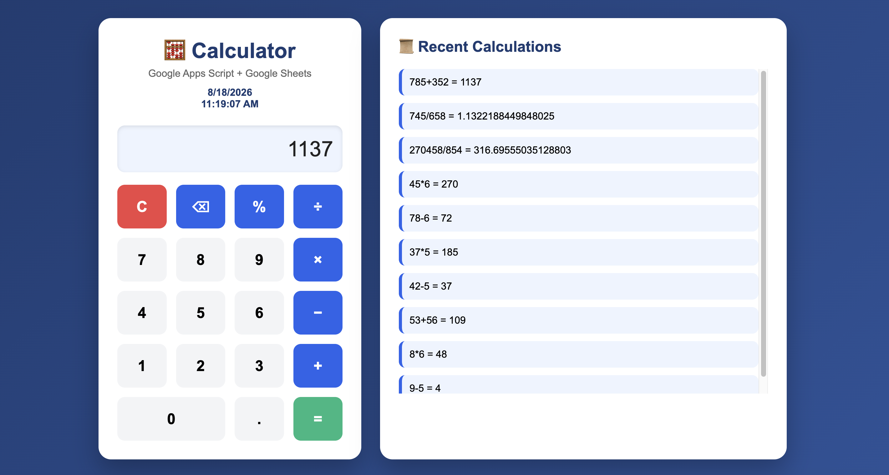
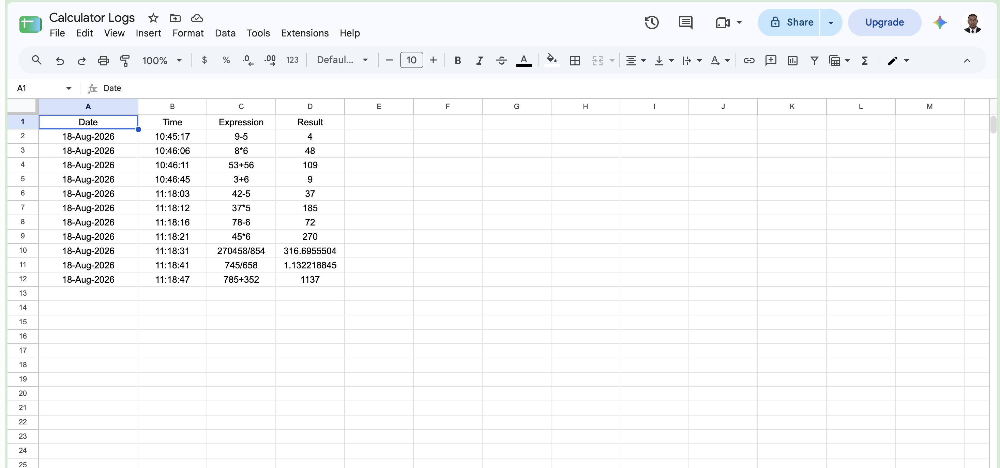

# 🧮 Google Apps Script Calculator

A modern calculator built with **Google Apps Script**, **HTML**, **CSS**, and **JavaScript**. The application performs basic arithmetic calculations and automatically stores every completed calculation in a Google Sheet.

---

## 📌 Features

- ➕ Addition
- ➖ Subtraction
- ✖️ Multiplication
- ➗ Division
- 📊 Automatic logging to Google Sheets
- 🕒 Date and time recorded for every calculation
- 📜 Recent calculations displayed on the web page
- ⌨️ Keyboard support
- ⌫ Backspace button
- 📱 Responsive user interface
- 🎨 Modern design with animations

---

## 🛠 Technologies Used

- Google Apps Script
- HTML5
- CSS3
- JavaScript (ES6)
- Google Sheets
- GitHub

---

## 📂 Project Structure

```
GoogleAppsScriptCalculator/
│
├── Code.gs
├── Index.html
├── Styles.html
├── Javascript.html
├── README.md
├── calculator.png
├── google-sheet.png
```

---

## ⚙️ Installation

1. Create a Google Sheet named **Calculator Logs**.
2. Rename the first sheet to **Logs**.
3. Open **Extensions → Apps Script**.
4. Create the following files:
   - Code.gs
   - Index.html
   - Styles.html
   - Javascript.html
5. Copy the project code into each file.
6. Save the project.
7. Deploy the project as a **Web App**.
8. Authorize access when prompted.
9. Open the Web App URL.

---

## 📊 Google Sheet Output

Every completed calculation is automatically stored in Google Sheets.

| Date | Time | Expression | Result |
|------|------|------------|--------|
|18-Aug-2026|10:37:58|332+65|397|
|18-Aug-2026|10:38:17|87-25|62|

---

## 📸 Screenshots

### Calculator



### Google Sheet Log



---

## 👨‍💻 Author

**Mamadou Bah**

Bachelor of Science in Information Technology (BSIT)

---

## 📄 License

This project is for educational purposes.
